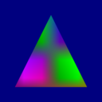
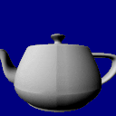
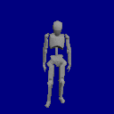
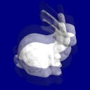

# 💫Orbit
This is a Work-In-Progress game engine using C++17

# 🔧Building
This project uses [Premake](https://premake.github.io/). It's a project generator configured with Lua scripts.

The first thing you'll want to do is to run the `init.sh` script. This is a bash script that fetches/builds the premake executable that we'll use to generate our project files. If you are on Windows and don't have any way of running bash scripts, [simply download the latest executable from their website](https://premake.github.io/download.html) and put it in the root directory of the project.

To generate files for your favorite IDE or build system, simply run the premake executable like so: 
`premake5.exe vs2019` (Windows) 
`./premake5 codelite` (Unix)

[Click here for a list of generators.](https://github.com/premake/premake-core/wiki/Using-Premake)

# 💉Samples

**Triangle** 
 
Obligatory triangle example (textured)

**Cube** 
 
This is the first 3D sample. 
Introduces a first-person free-flight camera and the usage of constant buffers and matrices.

**Model** 
 
Loads a teapot model from an OBJ file and renders it with a simple directional light.

**Animation** 
 
Loads a rigged mannequin model and a jump animation from separate COLLADA files and animates the model on a loop.

**Post Effects** 
 
Uses two render passes. The first one uses a regular scene shader to render a bunny to a separate framebuffer. The second pass uses another shader to sample on different points on the framebuffer and renders it to a fullscreen quad. The result is a distortion effect.